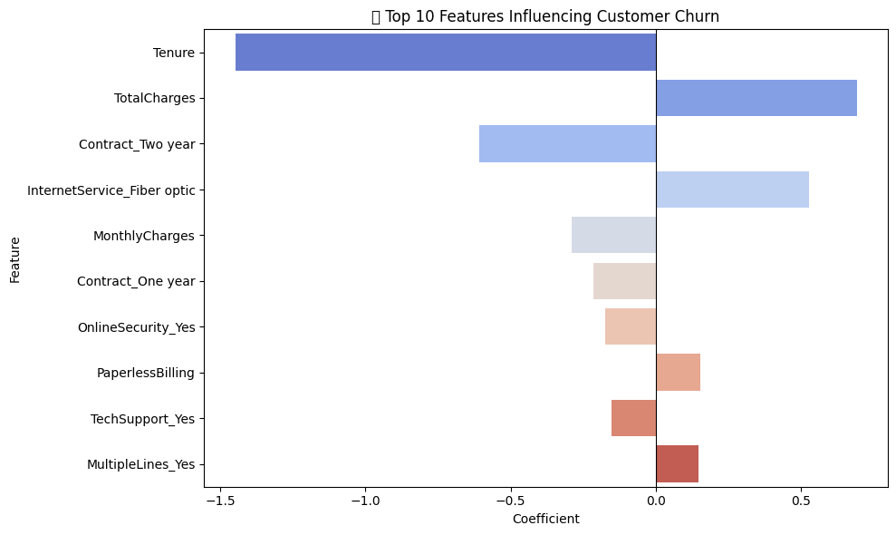

# 📊 Customer Churn Prediction

Predicting customer churn in a telecom company using Python and machine learning techniques.

---

## 📁 Dataset
This project uses the [Telco Customer Churn](https://www.kaggle.com/blastchar/telco-customer-churn) dataset which includes customer demographics, account information, and service usage.

---

## 🧠 Objectives
- Clean and preprocess raw customer data  
- Perform Exploratory Data Analysis (EDA)  
- Train a Logistic Regression model  
- Evaluate model performance  
- Identify key features contributing to churn

---

## 🛠 Tools & Libraries
- **Python**
- **Pandas**, **NumPy** for data manipulation  
- **Matplotlib**, **Seaborn** for visualization  
- **Scikit-learn** for modeling  
- **Jupyter Notebook** for development

---

## 🔍 Exploratory Data Analysis (EDA)
EDA revealed correlations between churn and:
- Contract type
- Tenure duration
- Payment method
- Online security & support options

> 📈 Sample chart:  

---

## ⚙️ Model Performance

| Metric        | Score  |
|---------------|--------|
| Accuracy      | 80.5%  |
| Precision     | 64% (Class 1) |
| Recall        | 57% (Class 1) |
| F1-Score      | 60% (Class 1) |

---

## 🔎 Feature Importance

- **Contract_Two year**: Strong negative churn predictor  
- **Tenure**: Longer tenure → lower churn  
- **MonthlyCharges**: Higher charges → slightly higher churn  
- **Partner**: Having a partner slightly reduces churn (`coef ≈ +0.016`)

---

## 🧠 Future Improvements
- Try ensemble models (Random Forest, XGBoost)  
- Add SHAP for feature explainability  
- Include customer lifetime value (CLTV)

---

## 👨‍💻 About Me

Hi, I'm **Bora Orhan** 👋  
🎓 MSc in International Business with Data Analytics  
🎓 BSc in Business Administration
💼 Data Analyst Intern @ Victoria Solutions  
📍 Birmingham, UK

🔗 [LinkedIn](https://www.linkedin.com/in/boraorhan) | 📬 boraorhanuk@gmail.com
